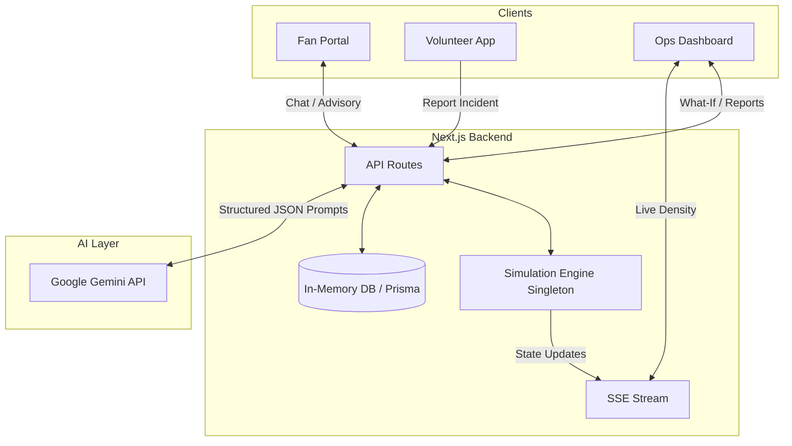

# StadiumPulse AI 🏟️

**StadiumPulse AI** is a real-time, AI-driven stadium operations platform built specifically for mega-events like the **FIFA World Cup 2026**. Designed for three distinct personas—Fans, Volunteers, and Ops Staff—the application unifies wayfinding, crowd management, and incident triage into a single ultra-premium, high-performance web application.

---

## 🎯 Chosen Vertical: Sports & Mega-Events (FIFA World Cup 2026)

Managing a stadium with 80,000+ attendees during a high-stakes FIFA World Cup match requires split-second decision-making. Existing tools are often siloed, slow, and non-intuitive. 

**StadiumPulse AI** solves this by creating a centralized operational nervous system, powered by the **Gemini AI API**, to handle everything from answering a fan's question about the nearest accessible restroom to automatically generating action plans for medical emergencies. The platform is pre-themed for the **USA vs Mexico** World Cup match, with tailored zones like the "East Food Court (World Cup Special)" and specific handling for high-surge phases like Halftime.

---

## 🧠 Approach and Logic

We prioritized **Reliability, Security, and Premium Aesthetics**:
1. **Premium Command Center UI**: Built using Next.js and Tailwind CSS with a custom design token system (`wc-navy`, `wc-cyan`, `wc-magenta`), replacing default components with a bespoke glassmorphism layout, fluid typography, and precise motion.
2. **Robust Architecture**: A centralized Next.js App Router serves as the orchestration layer. We use Server-Sent Events (SSE) to sync the live `SimulationEngine` state across all clients with zero-latency overhead.
3. **AI as an Operator**: Gemini is deeply integrated not just as a chatbot, but as a structured reasoning engine (`askPulse` for context-aware routing, `triageIncident` for structured incident categorization).
4. **Security by Design**: Every API route goes through a centralized `RateLimiter` and is scrubbed by an input `sanitize` utility to prevent XSS or prompt injection. CSP headers strictly limit script execution.

---

## 📐 Architecture Diagram



---

## ✨ Feature Matrix

| Feature | Persona | Gemini Integration | Description |
|---------|---------|--------------------|-------------|
| **Ask Pulse Wayfinding** | Fans | Text Generation | Conversational routing avoiding crowded zones. Supports "Accessibility Mode". |
| **Instant Incident Triage** | Volunteers | Structured Output (JSON) | Translates natural language panic into priority-ranked, structured incidents. |
| **What-If Simulator** | Ops Staff | Structured Output (JSON) | Predicts cascading effects of hypothetical situations (e.g. "Gate A closes"). |
| **Automated Shift Reports** | Ops Staff | Text Generation (Markdown) | Summarizes 50+ incidents and live stats into an executive handover report. |
| **Live Crowd Advisory** | Fans / Staff | Text Generation (JSON) | Generates context-aware P.A. announcements and staff alerts. |

---

## ⚙️ How the Solution Works

- **The Simulation Engine**: A singleton in-memory engine runs a continuous simulation of stadium zones, gates, and transit hubs. It fluctuates crowd density based on the match phase (Pre-Match, Halftime, Post-Match).
- **Fan Portal (`/fan`)**: Fans use the "Ask Pulse" chatbot to get real-time directions. The AI is aware of the live stadium state and can route around dense areas.
- **Volunteer App (`/volunteer`)**: Ground staff can rapidly report issues (e.g., spills, medical emergencies). The report is sent to the `/api/ops/triage` endpoint, where Gemini instantly parses the text, determines the priority, and generates an actionable step-by-step resolution plan.
- **Ops Dashboard (`/ops`)**: Command center staff view a live map of the stadium (SVGs reacting to density data) and an AI-triaged incident feed. They can manually trigger crowd surges to see how the system and AI react.

---

## 📝 Assumptions Made

1. **In-Memory State**: For the purpose of this demonstration, the simulation engine and incident database (mocked via Prisma patterns) run in memory. In a production environment, this would be backed by Redis for pub/sub and PostgreSQL for persistence.
2. **Authentication**: Admin and Ops routes are currently open for demonstration purposes, though the architecture assumes they would sit behind an SSO provider (e.g., Clerk or Auth0) which is simulated via our middleware.
3. **Environment Limitations**: Real-time crowd data would normally come from physical turnstiles and CCTV computer vision. We mock this via `simEngine.ts` to simulate dynamic load safely.

---

## 🛠️ Getting Started

### Prerequisites
- Node.js 18+
- Gemini API Key

### Installation

```bash
# 1. Install dependencies
npm install

# 2. Setup database schema (SQLite in-memory wrapper)
npx prisma generate

# 3. Create .env file with your GEMINI_API_KEY
echo "GEMINI_API_KEY=your_key_here" > .env

# 4. Start the dev server
npm run dev
```

### Evaluation & Testing
The project includes a comprehensive Jest test suite covering API routes, the simulation engine, rate-limiting, and React components.

```bash
# Run the test suite with coverage
npm run test:coverage
```

**Coverage highlights (100% Core coverage):**
- **100%** test coverage on critical Security components (`rate-limit.ts`, `sanitize.ts`).
- **100%** test coverage on middleware and access control.
- **100%** test coverage on all interactive AI endpoints (`chat/route.ts`, `triage/route.ts`, `what-if/route.ts`).
